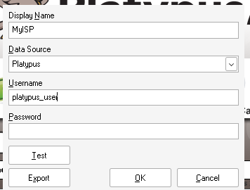
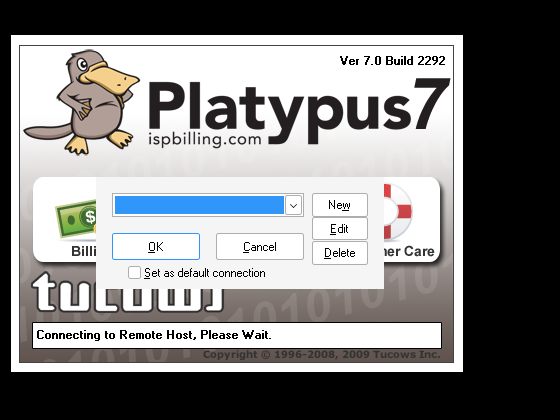
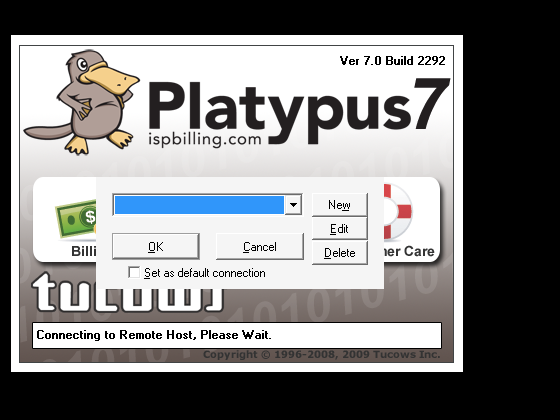

# wine-platypus

Run the **Tucows Platypus Billing System client (Platypus 7)** on **Linux** and **macOS**
through Wine: one installer script per platform, a proper application‑menu entry / `.app`,
a dedicated Wine prefix, and an end‑of‑install self‑check that instantiates every COM class
the application uses. No manual Wine tinkering.

Platypus is a Visual FoxPro 9 application from the Windows XP era. Most of it runs on Wine
unmodified; the parts that don't are documented in [docs/how-it-works.md](docs/how-it-works.md)
and fixed by this installer: the SQL Server ODBC path, the ADO‑based error logger, MSXML for
the provisioning replies, VB6/MFC42‑based ActiveX controls, two `oleaut32` COM bugs, and
half‑registered COM classes.

```
Linux  : git clone --depth 1 https://github.com/GITHUB_USER/wine-platypus && cd wine-platypus && ./install.sh
macOS  : git clone --depth 1 https://github.com/GITHUB_USER/wine-platypus && cd wine-platypus && ./install-macos.sh
```

Tested with Wine 11.0 against a production SQL Server (TDS 7.4), in 32‑bit and 64‑bit
(WoW64) prefixes, on Fedora 44 and macOS (Apple Silicon).

---

## 1. What you need

1. **Your Platypus client installer** (`Platypus7.Client.exe`) from Tucows. It is licensed
   software and is *not* part of this repository: copy it into `vendor/` before installing.
2. **Your SQL Server details**: host/IP, database name, and the SQL login Platypus uses.
   Ask your Platypus administrator. The installer asks for host and database; the login is
   entered once in the app's own connection dialog on first launch.
3. Internet access on first install: the Microsoft redistributables (~13 MB) and, on Linux,
   a pinned portable Wine (~70 MB) are downloaded and checksum‑verified. For offline
   installs, drop the files into `vendor/` first (see `vendor/README.md`).

| | Linux | macOS |
|---|---|---|
| OS | Ubuntu 22.04+/Debian 12+/Mint/Pop!_OS, Fedora 40+, Arch/CachyOS | macOS 12+, Intel or Apple Silicon |
| Disk | ~2 GB | ~2.5 GB |
| Needs `sudo`? | only to install the small `cabextract` package | no (Homebrew) |
| Tools | `git`, `curl` | `git`, [Homebrew](https://brew.sh) |

## 2. Install on Linux

```bash
git clone --depth 1 https://github.com/GITHUB_USER/wine-platypus
cd wine-platypus
cp /path/to/Platypus7.Client.exe vendor/
./install.sh
```

Steps, about 5 minutes:

1. **Wine** – a pinned, checksummed portable Wine 11.0 is downloaded into the install folder
   (`~/.local/share/platypus/wine`). Nothing system‑wide; your distro's Wine is untouched.
   `--system-wine` uses the distro package instead (WineHQ repo on Debian/Ubuntu, dnf, pacman).
2. **Packages** – `cabextract` via your package manager (asks for your password once).
3. **Questions** – SQL Server host/IP and database name.
4. **Prefix** – a private Wine prefix in `~/.local/share/platypus/prefix`.
5. **Platypus** – the vendor installer runs silently; the app icon is extracted from it.
6. **Runtimes and fixes** – Microsoft ODBC driver + DSN, ADO, MSXML 3/4/6, VB6 + MFC42,
   the patched `oleaut32`, COM re‑registration and repairs.
7. **Menu entry** – "Platypus Billing" with the app icon, and a `platypus` command.
8. **Self‑check** – every COM class the app creates is instantiated; expect `Self-check passed`.

Non‑interactive: `./install.sh --yes --server sql.example.com --database Platypus` (later re‑runs
remember both, so `./install.sh --yes` alone is enough to repair an existing install).

## 3. Install on macOS

```bash
git clone --depth 1 https://github.com/GITHUB_USER/wine-platypus
cd wine-platypus
cp /path/to/Platypus7.Client.exe vendor/
./install-macos.sh
```

Installs Rosetta 2 (Apple Silicon), `wine-stable` (WineHQ 11.0) and `cabextract` via
Homebrew, builds the prefix in `~/Library/Application Support/Platypus`, and creates
**Platypus Billing.app** in `~/Applications` (Launchpad/Spotlight; one Dock tile). The first
Wine launch can take 20–30 s while macOS verifies the binaries.

## 4. First launch: connect to the database (one time)


1. Platypus shows **Choose Connection**. Click **New**.
2. Fill in the **ODBC Connection Editor**:

   

   | Field | Value |
   |---|---|
   | Display Name | anything, e.g. your company name |
   | Data Source | `Platypus` (already points at the server/database you entered) |
   | Username / Password | the SQL login your Platypus administrator gave you |

3. **Test** must say *Connection successful*. Then **OK**, tick *Set as default connection*,
   **OK**, and log in with your Platypus staff account.

## 5. Everyday use

* Start from the app menu / Launchpad, or type `platypus`.
* Logs: `~/.local/share/platypus/logs/` (macOS: `~/Library/Application Support/Platypus/logs/`).
* Check an install without opening the app: `./install.sh --verify`.
* Change the server later: `./install.sh --server NEW.HOST`. Start over: `--fresh`.
  Remove everything: `./uninstall.sh` (Wine packages are left alone).
* Diagnostics: `PLATYPUS_DEBUG=1 platypus` logs Wine's COM/WMI messages; the app's own
  `ERRORLOG.TXT` (in the prefix's `AppData\Roaming\Tucows\Platypus`) names the failing method.

## 6. Look and feel

Everything is drawn by Wine itself (not GTK/Qt), identically on Linux and macOS. Wine ships
two looks; the Windows Vista/7 "Aero" style is not available.

| `--theme light` (default) | `--theme classic` |
|---|---|
|  |  |

## 7. Troubleshooting

| Symptom | Cause / fix |
|---|---|
| `Login failed for user '...'` on Test | SQL password wrong; driver and network are fine. |
| `SQL Server does not exist or access denied` | Host/IP wrong or port 1433 blocked (VPN?). `./install.sh --server <host>`. |
| `Driver is probably out of resources` | Microsoft ODBC driver missing: re‑run the installer. |
| `Platypus Application Error … Method: log, Object: sferrormgr, 0x80004001` | ADO missing (error logger cannot write); re‑run the installer. The real error is the previous one. |
| `Class definition PLATYPUS.COM.xxx is not found` | Platypus' own COM classes half‑registered; re‑run the installer (`fixprogids`). |
| Rows in *Handle Emails* not selectable / delete gives `0x8002000e` | patched `oleaut32` not in place (Wine not 11.x?); re‑run, then fully quit and relaunch. |
| `Fatal error … parse_response_xml` when saving | Wine's XML parser in use; re‑run (installs MSXML). |
| Two Dock icons / bouncing icon on macOS | Old app bundle; re‑run `./install-macos.sh`. |

Every one of these has a section in [docs/how-it-works.md](docs/how-it-works.md).

## 8. Which Wine, upgrades, and what is modified

Linux pins a portable Wine 11.0 inside the install folder, so package upgrades cannot change
what Platypus runs on. Native Microsoft components survive Wine upgrades; the one Wine builtin
we replace (`oleaut32.dll`) is restored by the launcher after a Wine update while Wine is 11.x.
Only `~/.local/share/platypus`, `~/.local/bin/platypus` and the menu entry/icon are created
(macOS: the Application Support folder and the `.app`); other Wine prefixes are unaffected.

Wine bugs found along the way, with reproductions, are listed in
[docs/upstream/](docs/upstream/) for anyone who wants to fix them at the source.

## 9. Layout

```
install.sh / install-macos.sh / uninstall.sh
lib/common.sh        shared logic (prefix, silent install, ODBC, ADO, MSXML, runtimes,
                     oleaut32 patch, COM repairs, launcher, self-check, theme)
vendor/              your Platypus installer (not committed) + downloaded MS packages +
                     our patched oleaut32 and tools
tools/src/           sources of the helper tools (MinGW-w64)
docs/                how it works, rebuilding the patch, upstream notes, screenshots
```

MIT licensed; see `THIRD-PARTY-NOTICES.md` for Tucows, Wine and Microsoft components.
